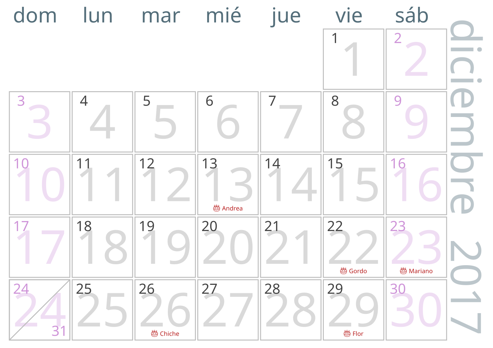

# py-cal
A python script to generate a calendar in SVG

Preview:



```
Usage:
  py-cal.py <year> <month> [options]
  py-cal.py (-h | --help)

Options:
  -b RGB   Color of background [default: 424242]
  -c FILE  Path to icalendar of birthdays [default: birthdays.ics]
  -f FILE  Path to icalendar of holidays [default: holidays.ics]
```
