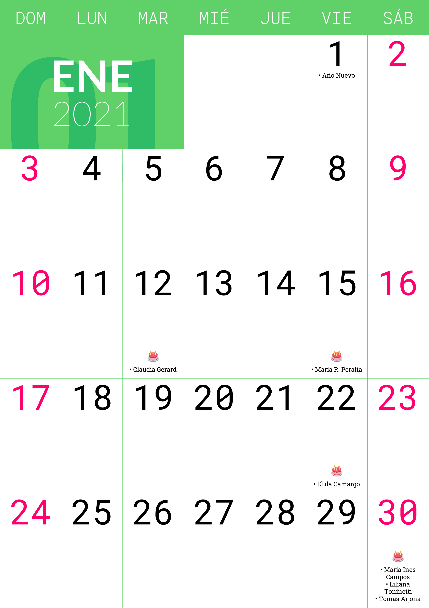

# py-cal
A python script to generate a calendar in PNG

> **NOTE: This project was rewriten and now is [Almanko](https://github.com/AIDEA775/Almanako).**

Preview:



# Run

Install dependencies with pip and virtual-env.

Edit the script with the current year and run:

```
./run.sh
```
